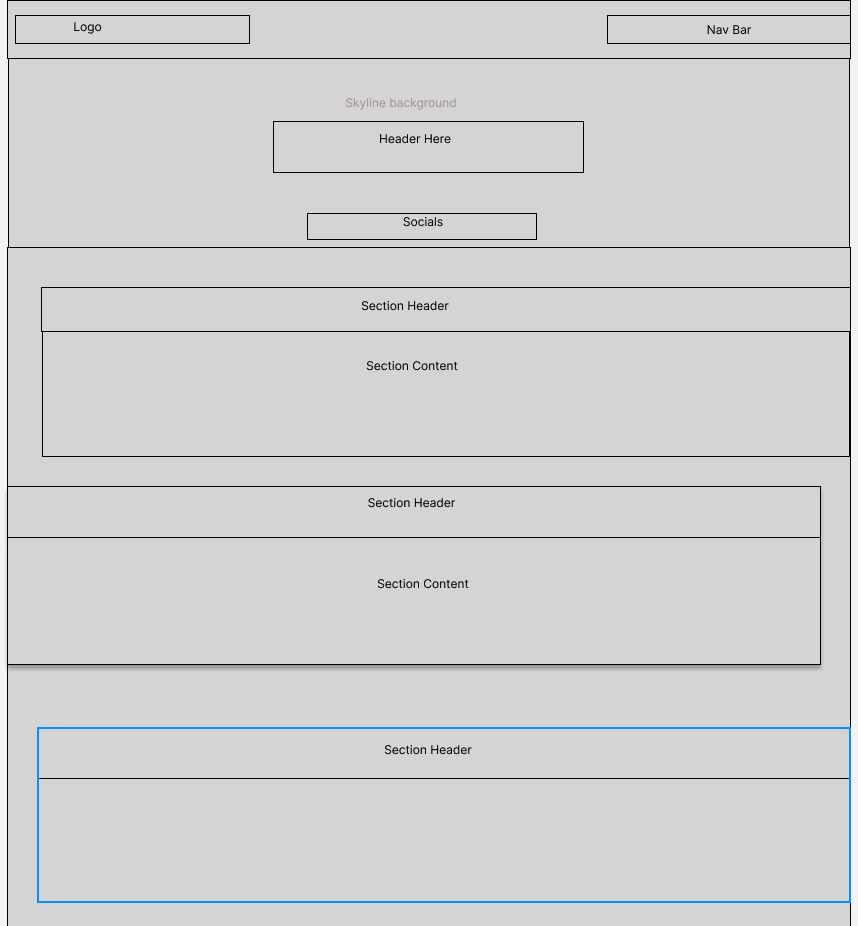

# First Copy Web Developer Portfolio

## Description

The motivation for this project was to make a responsive portfolio page that represents me and also, to create a space where I can showcase my projects. I built this project the way it is, to represent my idea of what a good website looks like, a simple design, with a nice clean layout and minimal tricks and decorations. I also built it so employers or other developers can see not only my projects but my skills in creating a responsive webpage. The problem this can solve is to show in a simple way what I can create in a given time frame all in one page, and not having to take the time to explain my knowledge through a regular resume. I learned many things about CSS through creating this project, a lot more than I would than if I had just studied the documentation of CSS. I learned how to incorporate flex displays in a way that I can comfortably format my page. I also learned how to use many other features such as pseudo-classes/elements and different types of transitions.

## Features

Some of the features that I have added to beautify my portfolio page was:

* Added a background image of the Toronto Skyline with a linear gradient covering to let people see the beauty of Toronto but also remember it is a background image.

* Made a responsive navigation bar with links that take you to my different social.

* Added a transition of opacity to my project photo links so that the user knows that they are hovering over the project and can click to visit the page for the project.

* Added a cool favicon just for fun :P

## Usage

The way this project should be used by others is as a reference to look at if they want to see how the styles that I have incorporated were created. This is also used as a well designed repository where I store all my projects so that employers and other web developers can see what I have created

## Demo

This is what the following webpage looks like:

## Wire Frame

You can view the wire frame below or in the assets folder!

## Deployed Application

Check out the live page at: https://keysbhag.github.io/Module2Challenge/

## Credits

Keyshawn Bhagwandin

## Tests

If you would like to have some fun and see how responsive the page is it test the responsiveness in Chrome Dev Tools:

* Right click on page and click inspect

* Click on the "Phone/table" button on the top right of the console that popped up

* At the of the page you'll see a drop down for "Dimensions"

* Click on the various screen sizes to see how the page will look on different devices

## License
N/A

---
© 2022 Keysbhag. Confidential and Proprietary. All Rights Reserved.